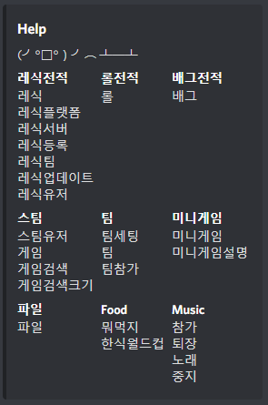
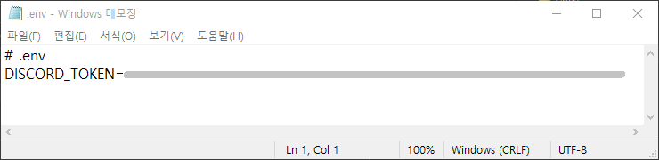

# KW-OSS-team_project

광운대학교 OSS개발 팀프로젝트

# 디스코드 봇
- 여러가지 편의 기능과 전적 검색 기능을 가지고 있는 디스코드 봇입니다.

## 명령어

- ```!!명령어```로 확인 가능

### 게임 전적 검색 기능
- ```!!레식 (레식 닉네임)``` - 레식 전적을 검색합니다.
- ```!!레식플랫폼 (PC/XBOX/PS4 중 1개 선택)``` - 전적 검색 플랫폼을 변경합니다.
- ```!!레식서버``` - 레식 서버의 상태를 확인합니다.
- ```!!롤 (롤 닉네임)``` - 롤 전적을 검색합니다.
- ```!!배그 (배그 닉네임)``` - 배그 전적을 검색합니다.

### 게임 검색 기능
- ```!!게임 (게임 이름)``` - 게임을 검색합니다.
- ```!!게임검색 (게임 이름)``` - 비슷한 이름을 가진 게임들을 검색합니다.
- ```!!게임검색크기 (최대 검색 크기)``` - 검색 결과를 보여줄 갯수를 정합니다.

### 레식 자동 팀 편성 기능
- ```!!레식등록 (자신의 레식 닉네임)``` - 자신의 레식 계정 정보를 등록합니다.
- ```!!레식유저``` - 등록된 계정 정보를 알려줍니다.
- ```!!레식팀``` - 등록된 계정 정보를 통해서 자동으로 팀을 편성합니다.
- ```!!레식업데이트``` - 등록된 계정 정보를 업데이트 합니다.

### 팀 편성 기능
- ```!!팀세팅 (팀 갯수) (팀의 크기)``` - 팀 편성 정보를 설정합니다.
- ```!!팀참가``` - 무작위 팀에 들어갑니다.
- ```!!팀``` - 편성된 팀의 정보를 알려줍니다.

### 파일 저장 기능
- ```!!파일``` - 저장된 파일을 불러옵니다.


### 음식 룰렛 기능
- ```!!뭐먹지``` - 다양한 메뉴들 중에서 원하는 옵션을 선택하면 그 중에서 랜덤하게 음식을 정해줍니다.
- ```!!한식월드컵``` - 한식 메뉴들 중에서 랜덤으로 16가지를 선별하여 월드컵을 진행합니다.

### 음악 재생 기능
- ```!!참가``` - 현재 자신이 사용하고 있는데 음성채널에 봇을 참가시킵니다.
- ```!!퇴장``` - 음성채널에 있는 봇을 퇴장시킵니다.
- ```!!노래 (youtube영상의 URL)``` - YouTube URL을 입력하면 노래를 틀어줍니다.
- ```!!중지``` - 현재 재생중인 노래를 중지합니다.


## 봇 추가하는 방법
1. 프로젝트 코드를 다운로드 하거나, fork 하여 컴퓨터에 저장
2. [디스코드 개발자 홈페이지](https://discord.com/developers)에 접속(로그인 필요)
3. Applications 탭의 오른쪽 상단의 'New Application' 버튼 클릭
4. 이름 입력
5. Bot 탭에 들어가 'Add Bot' 버튼 클릭
6. TOKEN 칸 밑의 'Copy' 버튼 클릭
7. 다운로드 받은 프로젝트 폴더에 '.env' 파일 생성
8. '.env' 파일을 메모장 등으로 열고 ```DISCORD_TOKEN=복사한 토큰 붙여넣기``` 작성

9. 다시 디스코드 개발자 홈페이지로 돌아가서 OAuth2 탭 클릭
10. SCOPES를 'bot'으로 설정하고, BOT PERMISSIONS을 'Administrator'로 설정 혹은 원하는 대로 설정
11. SCOPES칸 밑쪽에 있는 URL을 복사하고, 해당 페이지로 이동
12. 봇을 추가할 서버를 선택하고 '계속하기' 버튼 클릭(해당 서버에 자신이 '서버 관리 권한'이 있어야 함)

## 봇 실행 방법
1. 파이썬으로 bot.py 실행 (cmd 창에서 python bot.py)

## 봇 실행이 되지 않을때!!
1. 파이썬이 설치 되었는지 확인
2. cmd 창에 ```pip install -r requirements.txt``` 명령을 실행해서 필요한 모듈 설치
3. 파이썬 환경변수가 제대로 설정되었는지 확인
4. ```.env``` 파일의 이름이 제대로 설정되었는지 확인

## Music 명령어가 실행되지 않을때!
1. cmd 창에 ```pip install youtube_dl``` 명령을 실행해서 필요한 모듈 설치
2. FFmpeg 필요하니 해당 url통해서 설치하기```https://www.gyan.dev/ffmpeg/builds/ffmpeg-release-full-shared.7z``` 
3. FFmpeg 환경변수가 제대로 설정되었는지 확인

---

# License
**[MIT License](./LICENSE)**
